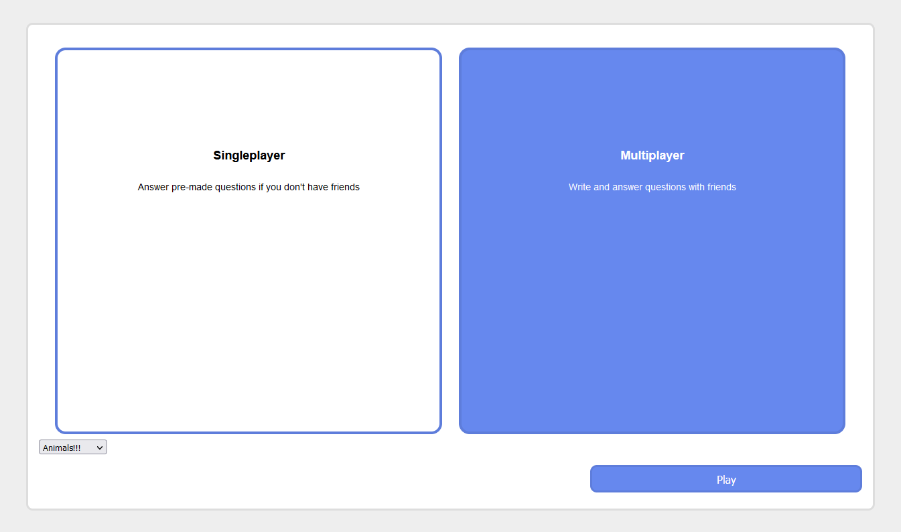

# Maiko's kahoot ripoff
On this website you can play quizzes alone or with friends. Its a lot like [Kahoot]("https://kahoot.com"), but just works a little worse.

## Usage
First, you need an account. Go to the registry page and enter a username and password. Don't use passwords you use on other websites, these passwords are **not** stored very securely. After you've made your account, go to the login page and enter your credentials.

You can create or join quizzes. To create a quiz, go to Create Game and select "Singleplayer" or "Multiplayer".

If you'd rather join an existing quiz, ask a friend for the join code and enter it in Join Game.
You can also find the codes for games in the Games List.

When you join or create a game, you enter a lobby. The creator of the game will start the game when everyone is ready.

The questions are multiple-choice, and at the end there will be a leaderboard.

## Screenshots
  
Logging in with username and password.

  
Creating a new game by selecting the category of questions.

  
Waiting to start the game in the lobby.

  
Being a genuis and answering every question correctly.

  
Being rewarded for your genius by a beautiful golden name at the top of the leaderboard.

  
A list of lobbies other people have made that you can join.

## Technical details
### Software used
* HTML, CSS & a little JavaScript
* Vanilla PHP
* MySQL

### General map of the codebase
This project was started when I knew exactly nothing about PHP and SQL, so its a bit disorganised.

Due to a lack of a router in PHP, all of the pages are are at the root of the repository. Their filenames correspond to the URL of the page.

In lobby.php and game.php, there needs to be a constant connection to the server for getting information about the other users in the game. To achieve this, the client connects to either [api/SSE_manager.php](api/SSE_manager.php) or [api/game_manager.php](api/game_manager.php), and creates a Server-Sent Events connection.

### Things learned
* Server-Sent Events  
  Basically a one-way connection to stream data from the server to a client. Used for lists of users in the lobby and the game
* SQL queries, tables and constraints  
  This was my first time working with SQL, so I learned the basics of all the things.
  Mainly how to connect different tables with foreign keys.
* Literally just PHP  
  Again, this was my first PHP project, so I learned a lot. I've done some stuff with server-side rendering before, so I was familiar with the concept, but that was with a JavaScript framework, not with PHP.
* Webhosting is painful  
  I tried using infinity free, but apparently they block Server-Sent Events, so now the multiplayer is broken and my presentation probably wont be as good. :(

Both files have some functions in separate files stored in ([api/functions](api/functions)) for better organisation. Files for the client interacting with the database are stored in [database_manager](database_manager), with the connection function being in [database_manager/db_connect.php](database_manager/db_connect.php).

All styling is done in [assets/stylesheets](assets/stylesheets), organised by the elements the styles are used on. Some pages require specific styles, which are stored in [assets/stylesheets/pages/page_[PAGENAME]](assets/stylesheets/pages).

Credentials for the database are stored in `.env`, but that file isn't included in this repository for security reasons.
